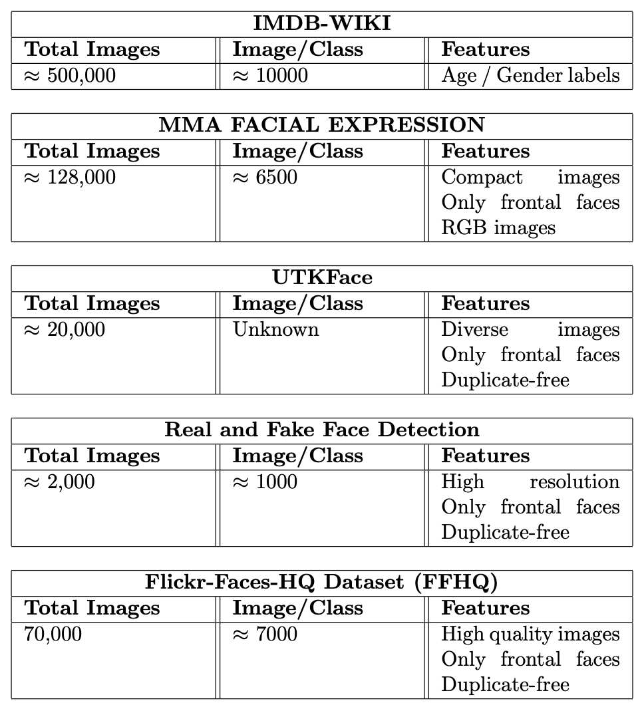

# Applied Artificial Intelligence and Classroom Activity Recognition 


## Overview
A Deep Learning Convolutional Neural Network (CNN) using PyTorch that analyses images of students in a classroom or online meeting setting and categorizes them into distinct states or activities.

1. **Facial Expression Recognition:**  Convolutional Neural Networks (CNN) for facial expression recognition. The dataset for this project includes images from a few publicly available datasets containing nu-
merous human facial expressions.

2. **Classroom Activity Recognition:** A Deep Learning CNN using PyTorch designed to analyze images of students in a classroom or online meeting setting, categorizing them into distinct states or activities.

## Dataset Summary
Here is a summary of the datasets used in the project:



## Submission Contents
1. Dependencies for running the Python script.
2. Python code for pre-processing, visualizing data, training, evaluating, and testing models.
3. Signed Originality form by all team members.
4. Structured Project report per guidelines.
5. Provenance information for datasets used.

## Steps for Running the Python File

### Prerequisites
- Python3
- Pip3

### Setup the Datasets
- Download and unzip the [Facial Expression Dataset](link-to-dataset).
- Download and unzip the [Classroom Activity Dataset](https://drive.google.com/drive/folders/15KX23UhhYKx6UGpm-GAEtIsPpweVRHJd?usp=drive_link) in the parent folder.

### Setup Virtual Environment
```bash
pip3 install --upgrade pip
pip3 install virtualenv
python3 -m venv venv
source ./venv/bin/activate
```

### Install Dependencies
```bash
pip3 install -r requirements.txt
```

### Execution Steps
- **Preprocess and Visualize:** `python3 preprocessor.py`
- **Train/Validate and Test Main Model:** `python3 cnn_training_early_stop.py; python3 cnn_testing.py`
- **Variants Training and Testing:** `python3 cnn_training_variant1.py; python3 cnn_training_variant2.py; python3 cnn_testing_variant_1.py; python3 cnn_testing_variant_2.py`
- **K-fold Cross Validation:** `python3 cnn_training_kfold.py`

### Expected Output
- Classification of images into respective classes.
- Display of training/testing dataset classification.
- Data visualizations using Matplotlib.
- Training over epochs with accuracy and loss metrics.
- Saved models under Model folder.
- K-fold analysis with training and validation metrics.

---

For further details on methodology, datasets, and findings, refer to the complete project reports.
