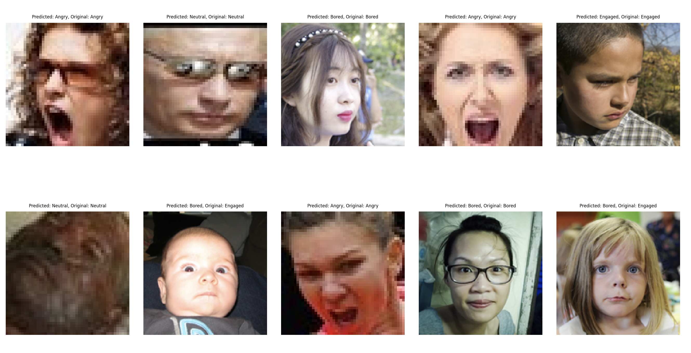
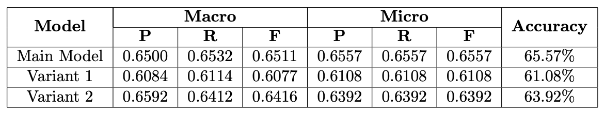
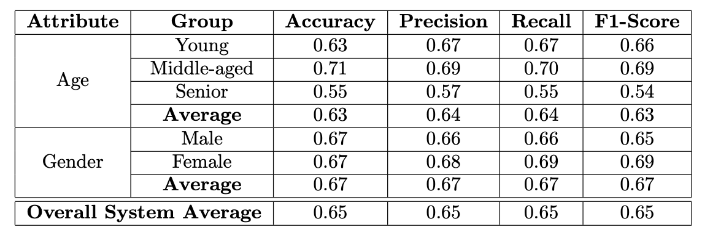
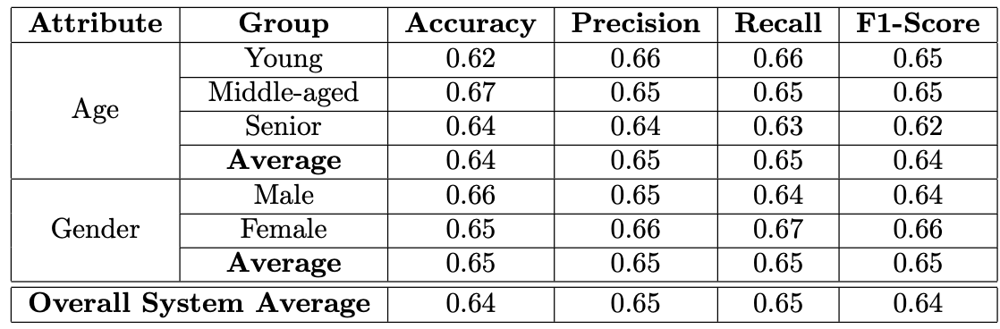
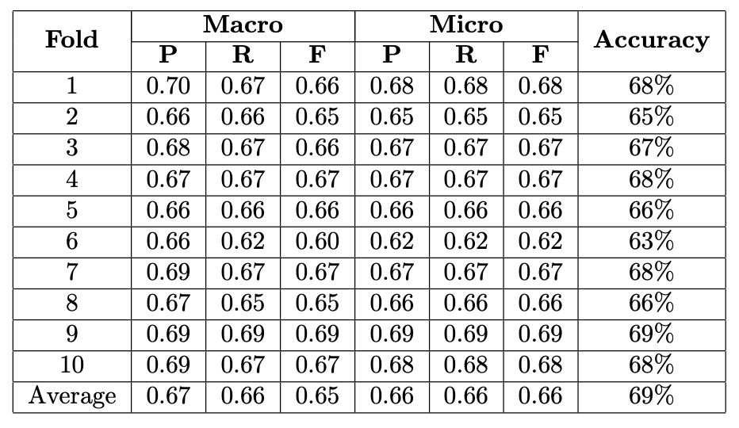
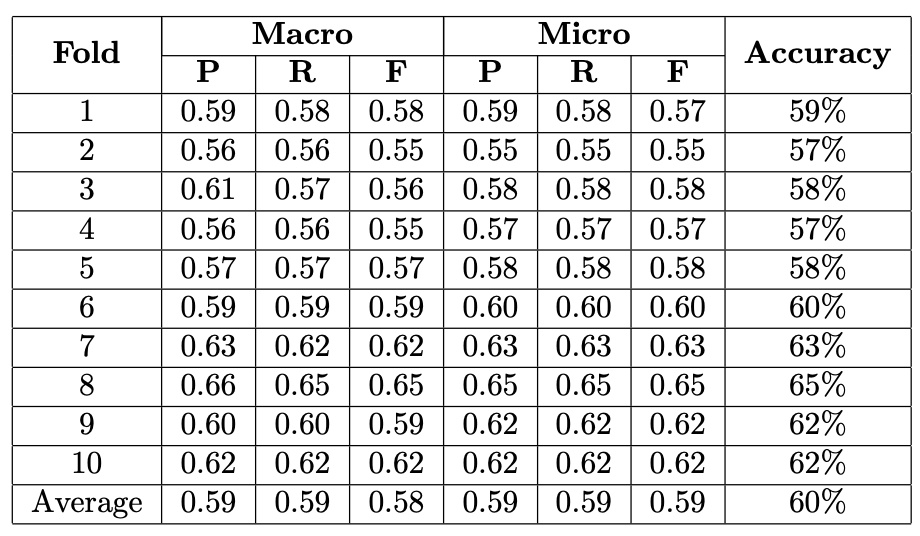

# Applied Artificial Intelligence and Classroom Activity Recognition 



## Overview
A Deep Learning Convolutional Neural Network (CNN) using PyTorch that analyses images of students in a classroom or online meeting setting and categorizes them into distinct states or activities.

1. **Facial Expression Recognition:**  Convolutional Neural Networks (CNN) for facial expression recognition. The dataset for this project includes images from a few publicly available datasets containing nu-
merous human facial expressions.

2. **Classroom Activity Recognition:** A Deep Learning CNN using PyTorch designed to analyze images of students in a classroom or online meeting setting, categorizing them into distinct states or activities.

## Contents
  - [Classification Labels](#classification-labels)

  - [Data Collection & Preprocessing](#data-collection--preprocessing)
    - [Dataset Summary](#dataset-summary)
    - [Images/Class Distribution](#imagesclass-distribution)
    - [Data Cleaning Process for Facial Expression Recognition](#data-cleaning-process-for-facial-expression-recognition)
      - [Labeling](#labeling)
      - [Resizing Images](#resizing-images)
      - [Grayscale Conversion](#grayscale-conversion)
      - [Brightness Normalization](#brightness-normalization)
      - [Cropping](#cropping)
    - [Class Distribution](#class-distribution-1)
  - [CNN Architecture , Training, & Evaluation](#cnn-architecture--training--evaluation)
    - [Architecture](#architecture)
  - [Bias Analysis, Model refinement, & deep evaluation](#bias-analysis-model-refinement--deep-evaluation)
    - [Performance Metrics](#performance-metrics)
    - [Variants comparison](#variants-comparison)
    - [Confusion Matrix Analysis](#confusion-matrix-analysis)
      - [Main Model](#main-model)
      - [Variants](#variants)
    - [Impact of Architectural Variations](#impact-of-architectural-variations)
    - [Bias Analysis](#bias-analysis)
      - [Bias detection result](#bias-detection-result)
      - [Bias Mitigation](#bias-mitigation)
      - [Bias detection result after mitigation](#bias-detection-result-after-mitigation)
    - [K-fold Cross Validation](#k-fold-cross-validation)
      - [Original Model](#original-model)
      - [K-fold Model](#k-fold-model)
      - [original vs k-fold](#original-vs-k-fold)
  - [Steps for Running the Python File](#steps-for-running-the-python-file)
    - [Prerequisites](#prerequisites)
    - [Setup the Datasets](#setup-the-datasets)
    - [Setup Virtual Environment](#setup-virtual-environment)
    - [Install Dependencies](#install-dependencies)
    - [Execution Steps](#execution-steps)
    - [Expected Output](#expected-output)

 - [Refecence to the original project](#refecence-to-the-original-project)
  - [Conclusion and Future Work](#conclusion-and-future-work)

## Classification Labels

- Angry
- Neutral
- Engaged
- Bored


# Data Collection & Preprocessing


## Dataset Summary
Here is a summary of the datasets used in the project:

    BIXI - Movements history
        Total row: ~4018722
        Column: 6
        Features: start_date, start_station_code ,end_date , end_station_code, duration_sec, is_member
        Source: https://bixi.com/en/open-data/

    Historical Hourly Weather Data
        Total row: ~45253
        Column: 37
        Features: 30 US & Canadian Cities + 6 Israeli Cities
        Source: [https://www.kaggle.com/datasets/mahmoudima/mma-facial-expression](https://www.kaggle.com/datasets/selfishgene/historical-hourly-weather-data)

  
## Images/Class Distribution

    Class Training Test
    Angry	  600	  60
    bored	  800	  50
    Engaged	850	  70
    Neutral	750	  65


## Data Cleaning Process for Facial Expression Recognition

### Labeling

### Resizing Images
All images are resized to a standard dimension to ensure consistency across the dataset.

```python
from keras.preprocessing.image import ImageDataGenerator

# Assuming images are in a directory 'data/train'
datagen = ImageDataGenerator(rescale=1./255)

# Standard dimensions for all images
standard_size = (150, 150)

# Generator will resize images automatically
train_generator = datagen.flow_from_directory(
    'data/train',
    target_size=standard_size,
    color_mode='grayscale', # Convert images to grayscale
    batch_size=32,
    class_mode='categorical'
)
```
### Grayscale Conversion

Images are converted to grayscale to focus on the important features without the distraction of color.
### Brightness Normalization

Uniform lighting conditions are applied to images to mitigate the effects of varying illumination.

```
# Additional configuration for ImageDataGenerator to adjust brightness

datagen = ImageDataGenerator(
    rescale=1./255,
    brightness_range=[0.8,1.2] # Adjust brightness
)
```
### Cropping

Images are cropped to remove background noise and focus on the face, the most important part for emotion detection.

## Class Distribution

## Sample Images

## Pixel Intensity Distribution


# CNN Architecture , Training, & Evaluation

## Architecture

- Input: 48x48 RGB images.
- Convolutional Layers: Multiple layers with 4x4 kernels, batch normalization, leaky ReLU activation.
- Pooling Layers: Max pooling layers with 2x2 kernels.
- Fully Connected Layers: 2 fully connected layers with dropout and softmax activation.
- Parallel Processing: nn.DataParallel for multi-GPU support.
- Training Monitoring: Tracks validation set performance to optimize model parameters.

# Bias Analysis, Model refinement, & deep evaluation

## Performance Metrics



## Variants comparison

- Main Model beats Variant 1 in accuracy and macro metrics.
- Main Model slightly more accurate than Variant 2.
- Variant 2 has better macro precision, less false positives.
- Trade-off: Higher recall can mean more false positives; higher precision means fewer false alarms.

## Confusion Matrix Analysis

- There’s a consistent trend across models where Engaged (Class 3) and Bored (Class 2) are often confused. This could be due to similarities in facial expressions or insufficient distinguishing features.
- The Neutral and Angry classes seem to be well-recognized across all models, suggesting that these facial expressions are more consistent and universally recognizable.
- Overall, distinguishing between expressions Class 3 (Engaged) and Class 2 (Bored) poses a challenge for these models. This might be due to the lack of diversity and quality of data.

### Main Model
- Class 2 (Bored) is often confused with Class 3 (Engaged).
### Variants

- Similar patterns of confusion as the Main Model, with Class 3 (Engaged) and Class 2 (Bored) having notable misclassifications.

## Impact of Architectural Variations

- Adding layers in Variant 2 did not improve performance consistently.
- More layers could capture complex features but risk overfitting.
- Decreased accuracy in Variant 2 might stem from overfitting.
- Main Model's moderate kernel size balances detection of fine and broad features, yielding highest accuracy.

## Bias Analysis

The bias attributes of Age and Gender were analysed to check for disparities in performance across different subgroups. This included the following steps

- The dataset was split into subclasses based on the attributes Gender - Male and Female
Age - Young, Mid and Senior
- The performance metrics of the CNN model were evaluated for each subgroup to check for the presence of biases.
• The dataset was augmented to mitigate the bias.


### Bias detection result



### Bias Mitigation

    The system was biased against people in the Senior age category. For bias mitigation, the dataset was rebalanced by increasing the count of images from the Senior age category and the images from the Mid and Young age brackets were reduced. The subclasses in the Gender attributes did not show any biases.

### Bias detection result after mitigation



## K-fold Cross Validation

### Original Model



- Accuracy graph displays fluctuations between 0.63 and 0.69 over 10 measurements.
- Notable accuracy dips occur at the 4th, 6th, and 9th measurements, with the 6th showing the sharpest drop.
- Precision is relatively stable; both Recall and F1 Score significantly drop at the 5th fold.
- The metrics reveal inconsistent model performance, particularly poor at the 5th fold.

### K-fold Model



- Accuracy across 10 folds, with a score varying from just above 0.57 to just under 0.65.
- Accuracy significantly improves at fold 7, peaking near 0.65 before declining again.
- Macro Precision and Recall exhibit significant volatility, while the F1 Score remains more consistent.
- All three metrics peak at fold 8, with Macro Recall showing the greatest increase.

### original vs k-fold

- K-fold cross-validation yields slightly higher average accuracy than train/test split due to varied data subset performance.
- It evaluates the model over multiple folds for a comprehensive performance assessment.
- Consistent performance across k-folds suggests better model generalization and can influence model selection.

# Steps for Running the Python File

### Prerequisites
- Python3
- Pip3

### Setup the Datasets
- Download and unzip the [Facial Expression Dataset](link-to-dataset).
- Download and unzip the [Classroom Activity Dataset](https://drive.google.com/drive/folders/15KX23UhhYKx6UGpm-GAEtIsPpweVRHJd?usp=drive_link) in the parent folder.

### Setup Virtual Environment
```bash
pip3 install --upgrade pip
pip3 install virtualenv
python3 -m venv venv
source ./venv/bin/activate
```

### Install Dependencies
```bash
pip3 install -r requirements.txt
```

### Execution Steps
- **Preprocess and Visualize:** `python3 preprocessor.py`
- **Train/Validate and Test Main Model:** `python3 cnn_training_early_stop.py; python3 cnn_testing.py`
- **Variants Training and Testing:** `python3 cnn_training_variant1.py; python3 cnn_training_variant2.py; python3 cnn_testing_variant_1.py; python3 cnn_testing_variant_2.py`
- **K-fold Cross Validation:** `python3 cnn_training_kfold.py`

### Expected Output
- Classification of images into respective classes.
- Display of training/testing dataset classification.
- Data visualizations using Matplotlib.
- Training over epochs with accuracy and loss metrics.
- Saved models under Model folder.
- K-fold analysis with training and validation metrics.

---

# Refecence to the original project

For further details on methodology, datasets, and findings, refer to the complete project reports.

[Report link](https://drive.google.com/file/d/1UK6j3DjhrO8KpWphuGjH5DNlrq098ysv/view?usp=sharing)

# Conclusion and Future Work
